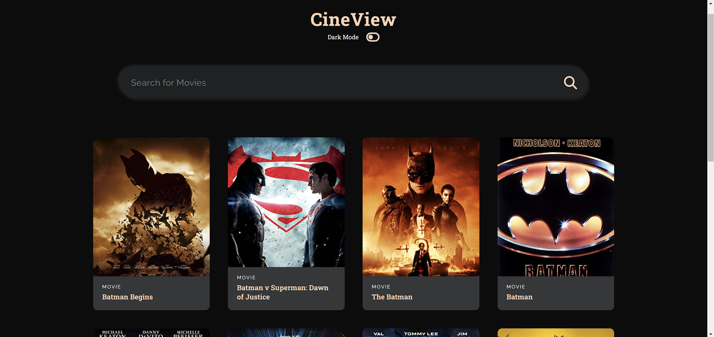
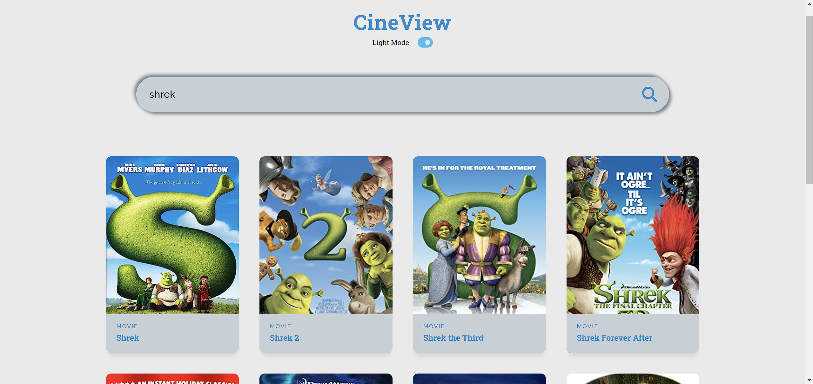

# CineView App

# Description
Movie App that allows users to search for their favorite movies and see their basic information such as year of release, title etc.

## Live Demo link:
[soon]()

## Technologies
- ReactJS
- Open Movie Database API (OMDb)

## Screenshots

  
  

## Setup
- download or clone the repository
- run `npm install`
- run `npm start`
